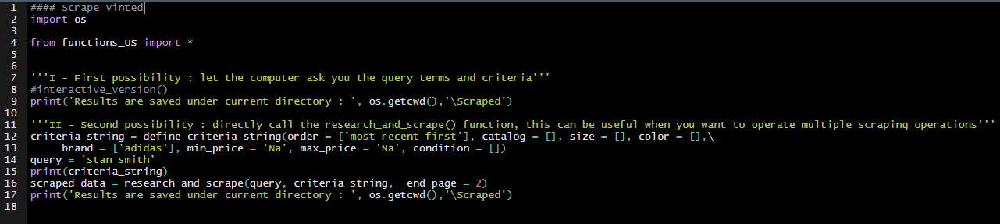
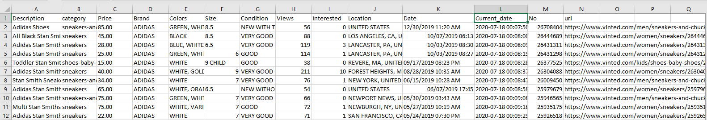

# scrapeVIN  
:new::new::new:A python package for scraping vinted :new::new::new: 
--------------------------------------------------------------------------------------------------------------------------------------------------------------------------------
--------------------------------------------------------------------------------------------------------------------------------------------------------------------------------
unofficial VINTED API for Python 
--------------------------------------------------------------------------------------------------------------------------------------------------------------------------------
--------------------------------------------------------------------------------------------------------------------------------------------------------------------------------

Website | State of development
--------|----------------
France, Belgium, Luxembourg, Netherlands, Spain (same exchange platform)| :heavy_check_mark:
United States | :heavy_check_mark:
United Kingdom| :heavy_check_mark:
Germany| :heavy_check_mark:
Poland| :heavy_check_mark:
Czech Republic| :heavy_check_mark:
Lithuania| :heavy_multiplication_x:

--------------------------------------------------------------------------------------------------------------------------------------------------------------------------------
--------------------------------------------------------------------------------------------------------------------------------------------------------------------------------
:information_source:Setup and utilization :  
1. According to your country's vinted website, modify line 8 on */Codes/Scraper_final.py*
1. Got to the *functions_YOURCOUNTRY.py* script and change your chrome driver location on line 61
2. Open *Scraper_final.py*, the two options are clearly defined there, that is all : the package is ready for scraping ! :smiley:

-----> *e.g.* I want to scrape the US website, I modify line 8 on Scraper_final to from "functions_US import * ", then I go to line 61 in *functions_US* and indicate the location of my chrome driver, and finally I can use the package directly in the *Scraper_final.py* interface ! :100::100: 

*Scraper_final.py* overview :  

..then console when running code :  

..and finally the scraped data, saved in .csv format :  
  

:information_source: You can also have a look at the */Codes/DataExploration.R* code, which displays a few interesting plots for future analysis. This can be a good starting point. A sampled of the plots are placed in the *Data/Exploratory Analysis Plots* directory.  

:information_source: Please report any bug/issue in the *issues* section or directly at sebcararo@hotmail.fr (Any feedback is really appreciated :speech_balloon: :+1:). A :star2: is also greatly appreciated :raised_hands:.  

--------------------------------------------------------------------------------------------------------------------------------------------------------------------------------
--------------------------------------------------------------------------------------------------------------------------------------------------------------------------------
--------------------------------------------------------------------------------------------------------------------------------------------------------------------------------

:uk:  
Vinted is a Lithuanian online marketplace and community that allows its users to sell, buy, and swap secondhand clothing items and accessories [1]. Due to its large and increasing amount of users accross multiple countries, it is also a tremendous source of information concerning reselling prices according to multiple factors such as items condition, colors, sizes, and so on. One could be interested in data analysis towards this database for multiple reasons, such as educational purposes, buy/resell strategies, or even just to appreciate the correct price for buying or selling any specific article. This python package was developed in order to being able to make research on the website, to collect the research pages and finally store the data in a comprehensive csv format. 
Functionalities : 
- Research by query (e.g. 'Air Force One')
- Add multiple filters : size, color, catalog, order the research (most recent first, increasing price, decreasing price, relevance)
- Decide where to stop the research. One can decide until which page you want the program to collect data 
- The package was designed for the french website, however the website architecture is the same for all countries, so one can easily adapt the existing code for any specific language (just need to change a few words in the functions.py code) ---> international versions coming soon!
- Interactive version : just let the program ask you the filter you want to input  

:fr:  
Vinted est un marché en ligne communautaire qui permet à ses utilisateurs de vendre, d'acheter, et d'échanger des vêtements et accessoires d'occasion [2]. Grâce à son large et croissant nombre d'utilisateurs à travers de nombreux pays, le site recense une quantité fantastique d'information concernant les prix de reventes de milliers d'articles et de vêtements, en fonction de facteurs divers tels que l'état, le coloris, la taille, etc... Nous pourrions être intéressés par l'analyse de ces données dans différents cadres, tels que les travaux académiques (études du comportement, étude de marché, analyse de données brutes), la mise en place de stratégies d'achat/revente, ou encore simplement pour déterminer le prix juste pour acheter ou bien revendre un article. Ce package python a été développé pour faire des recherches sur le site, collecter les données des items de la recherche, et finalement ranger les données dans un format csv facilement exploitable. 
Fonctionnalités : 
- Recherche par requête textuelle (e.g. 'Air Force One')
- Ajout de filtres de recherche : taille, couleur, catalogue, ordre d'apparition (le plus récent d'abord, prix croissant, prix décroissant, pertinence) 
- Choix de la page maximale de recherche (e.g. collecter les données jusqu'à la page 40) 
- Le package a été développé pour la version française du site, toutefois l'architecture du site reste la même pour les autres versions, et il est facile d'adapter le code à ces versions en modifiant quelques passages dans le fichier functions.py. -----> Versions internationales à venir!
- Version interactive : l'utilisateur peut simplement répondre aux questions du programme pour faire la recherche à travers l'API

[1] Vinted Wikipedia EN : https://en.wikipedia.org/wiki/Vinted  
[2] Vinted Wikipedia FR : https://fr.wikipedia.org/wiki/Vinted  

BTC : 3PkoHLXmXsL8kBrFu7GQ8kpmzPBmNK6m8B  
ETH : 0xFdbB5aF291cB7e711D62c1E4a8B58d0EbD423F9C
